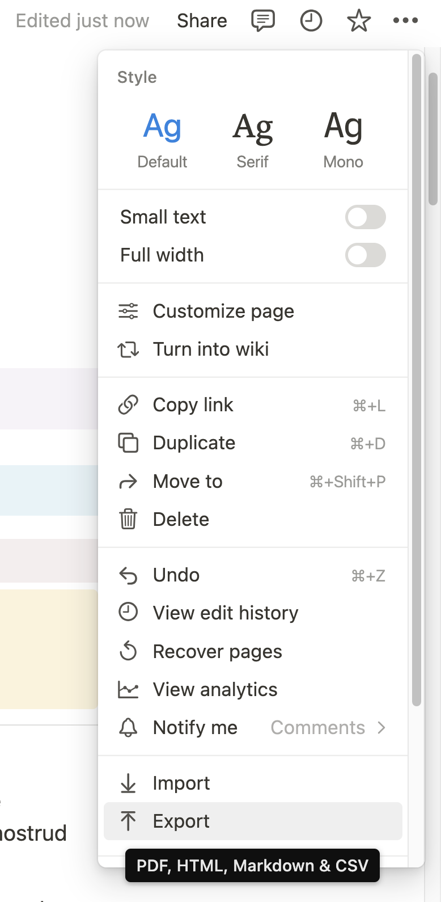
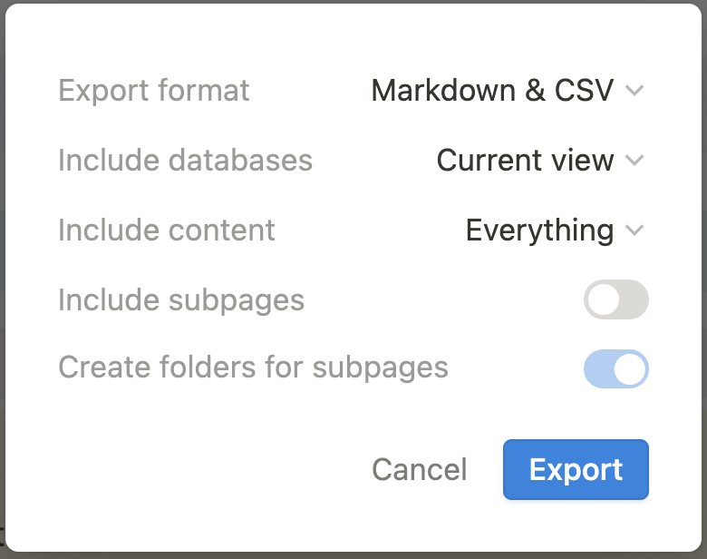
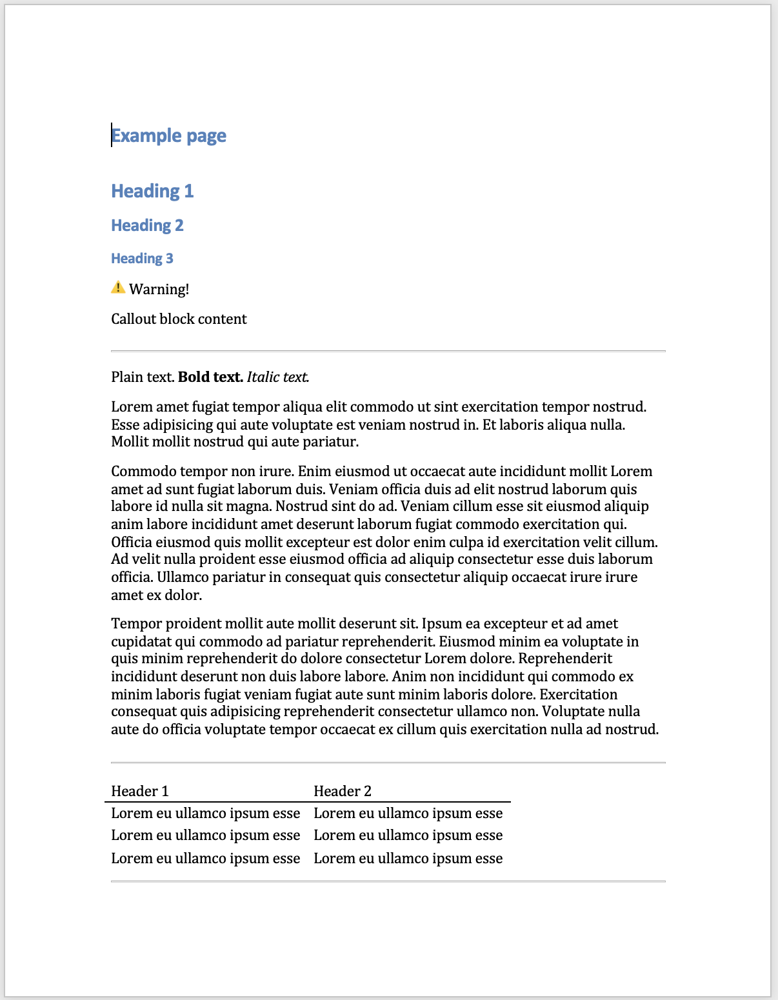
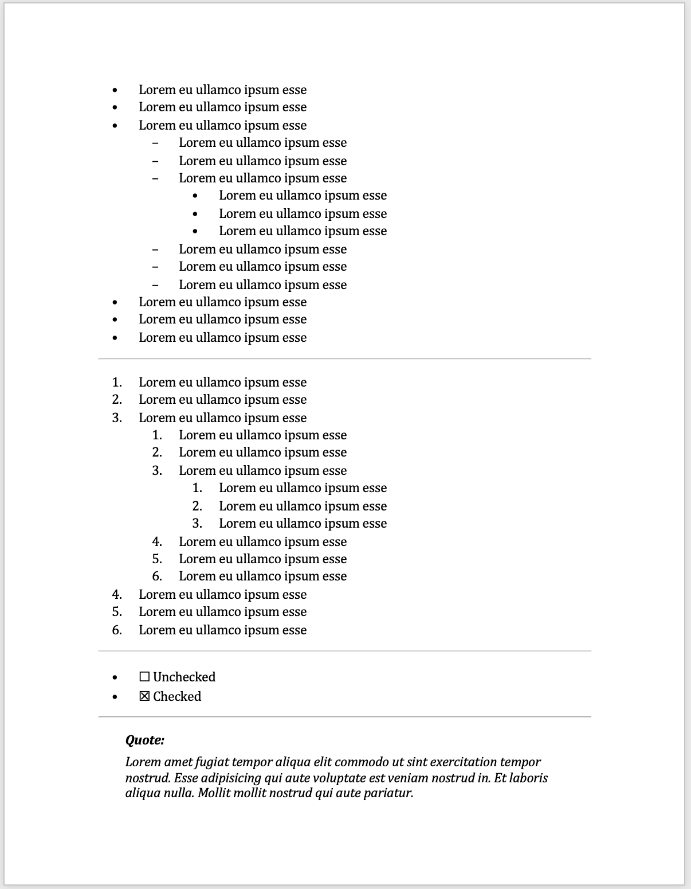
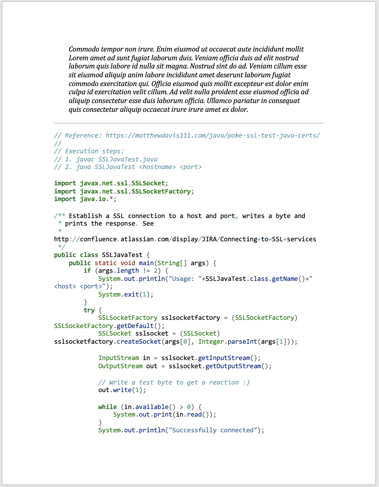
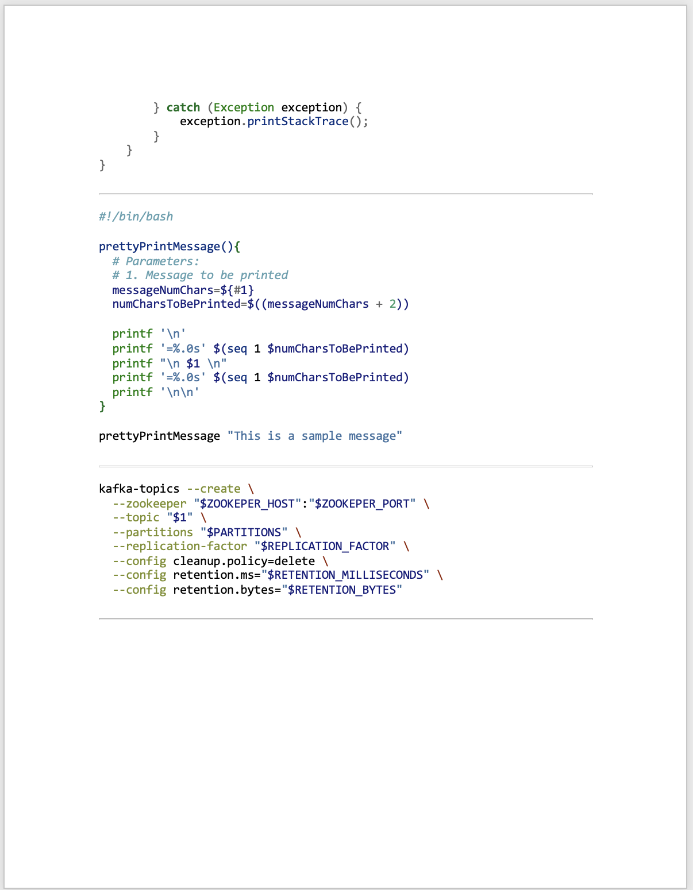
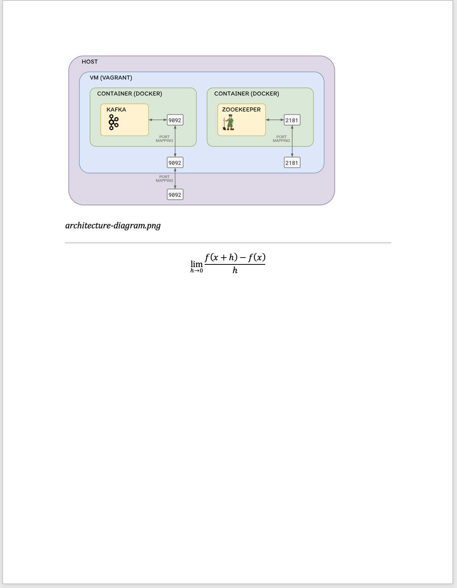

# Notion Markdown to Word

> __⭐️ Shell script that transforms Notion Markdown files to Word files in macOS.__

This is very convenient if you ever need to export a Notion page to a Microsoft Word file for some reason.

## Prerequisites

Install [pandoc](https://pandoc.org/):
```shell
brew install pandoc
```

## Usage

1. Go to your Notion page and export it in Markdown format  
   
   
2. Execute the shell script from a terminal
   ```shell
   ./notion-md-to-docx.sh
   ```
3. The output Word file should automatically open! 🪄
4. The output file will be located in `~/Downloads/notion-export-content/word.docx` 

## Example

[Example Notion page](https://carlos-sanabria-miranda-templates.notion.site/Example-page-d87c20d4879b49c8afd31ad681752e99)

The Notion page above was transformed into a Word document using this project.

<!--suppress CheckImageSize -->
<details>
<summary>Screenshots of the output word document</summary>







</details>

The output document is also available [here](output/word.docx).

## Tips and limitations

* Do not use toggles, bookmarks, embeds, or any other advanced Notion features. Just stick to the ones used in the example page.
* Font colors are lost in the transformation. If you need to keep them, you will have to manually edit the Word file. 
